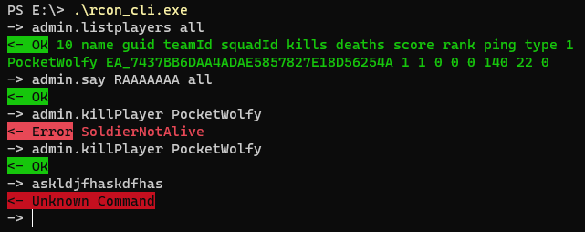

# Rcon CLI

Extremely simple and BF4-specifics-unaware (yet) library to send and receive strings.

## Usage

- `--raw` to disable color output and extra formatting.

### Subcommand: (none)
This is the default, you will get a simple REPL like this:


### Subommand: `query`
Just sends a single query and returns the result.
```
rcon_cli query admin.killPlayer PocketWolfy
```

### Subcommand: `events`
Will monitor all incoming events. By default, punkbuster messages are filtered out.
```
rcon_cli events
rcon_cli --punkbuster yes events
```

You can just dump all events to a file in `./logs` by running the following:
```
rcon_cli events --to-file yes
```

## Setting IP/port/password via `.env` file
I also read in environment variables (one per line) from a .env file in the current working
directory or up!
Put this anywhere in your current working directory (or up):
```
BFOX_RCON_IP=12.34.56.78
BFOX_RCON_PORT=30300
BFOX_RCON_PASSWORD=qw3rTY1337
```

## Installing
You can find pre-compiled binaries [on the GitHub releases page](https://github.com/Kiiyya/rcon_cli/releases/).

But if you have `cargo` available, you might as well just install from source:
```
cargo install --git https://github.com/Kiiyya/rcon_cli
```
...which also puts `rcon_client` in your `PATH`, yay :>.

<!-- OPTIONS:
        --ip <rcon_ip>                Sets the RCON IP [env: BFOX_RCON_IP=]
        --password <rcon_password>    Sets the RCON password. If possible, please use an environment
                                      variable or .env file instead! [env: BFOX_RCON_PASSWORD=]
        --port <rcon_port>            Sets the RCON port [env: BFOX_RCON_PORT=] -->